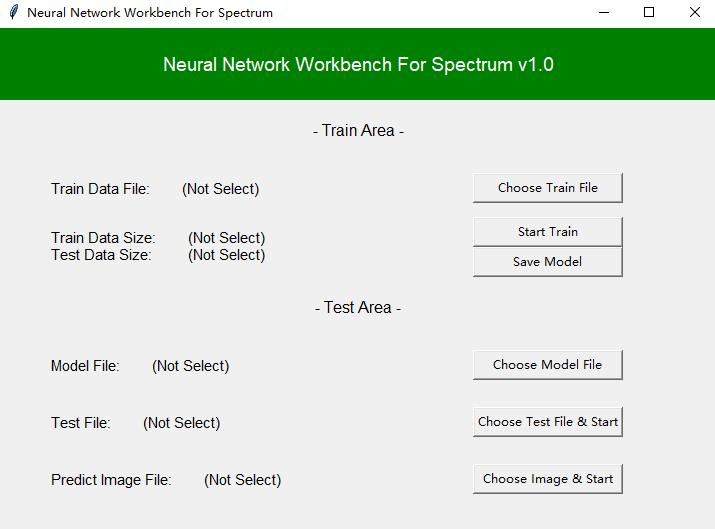

## Neural Network for Spectrum

### Introduction
This is a Project for people who doesn't know Neural-Network-Programming to train their data with simply click buttons on the window. To get the right result, you must strictly respect the following `Data-Format`:

#### 1. Train Dataset (File format: `.csv`)<br>
Train Dataset should be `csv` file with the `first column` is `class`, `the rest columns` are `feature values`. One row is one sample. It should look like this:
 
 <div align=center></div>

 #### 2. Test Dataset (File format: `.csv`)<br>
 Test Dataset also should be `csv` file. All columns are features values.

<div align=center></div>

 #### 3. Test Image (File format: `.csv`)<br>
  Test Image also should be `csv` file. If the size of Image is (320, 20), then the length of test file should conclude: 320 x 20 = 6400 rows.

### Usage
Install the required packages with following command.
```python
pip install -r requirements.txt
```
Start the Application
```python
python Start.py
```
Then you will see this window:

<div align=center></div><br>

#### Train
Press the `Choose Train File` to choose your train_set file, you can choose open `Data Distribution Function` or not. `Data Distribution Function` may take a while to draw the result picture, you need to wait until the result image shows.

<div align=center></div><br>
<div align=center></div><br>

Press `Start Train` to start the training task, set the `test_size` and `epochs`, then you can see the progress in the terminal window.

<div align=center></div><br>
<div align=center></div><br>

Press `Save Model` to save this model.

#### Test
To test your model, you need to load model at first. There are two modes to do prediction (`test row data` & `test image`). 
#### 1. test row data
Choose your row data file, you can get this row's material class in the terminal like this:

<div align=center></div><br>

#### 1. test Image data
Choose your row data file, you will see the color image which has already mapped the material ID to the specific color like this:

<div align=center></div><br>
